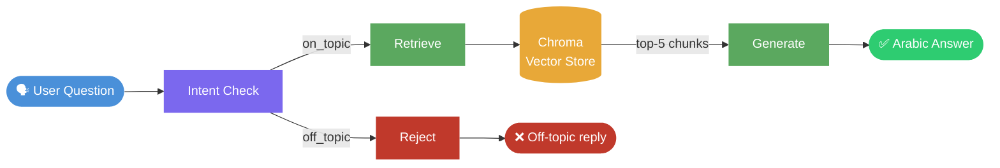

# DEPI Graduation Project — Egyptian Law RAG Agent


A retrieval-augmented generation (RAG) assistant that answers questions about **Egyptian law** in Arabic. The project ships with a fixed legal corpus and a pre-built vector index — clone, configure Azure OpenAI, and run. No extra documents or corpus changes are required.

**Repository:** [github.com/N0-Regrets/DEPI-Graduation-Project](https://github.com/N0-Regrets/DEPI-Graduation-Project)

> ⚠️ **RAGAS evaluation is not yet functional.** The pipeline is included in the codebase but is untested. See [Future work](#future-work) for details.

---

## Quickstart

```bash
git clone https://github.com/N0-Regrets/DEPI-Graduation-Project.git
cd DEPI-Graduation-Project
python -m venv .venv && source .venv/bin/activate  # Windows: .\.venv\Scripts\Activate.ps1
pip install -r requirements.txt && pip install langchain-openai
# Add your Azure OpenAI credentials to .env (see Configuration)
streamlit run app.py
```

---

## Features

| Component | Description |
|-----------|-------------|
| **Intent gate** | Classifies each question as Egyptian-law-related (`on_topic`) or not (`off_topic`) before retrieval |
| **Vector store** | [Chroma](https://www.trychroma.com/) with cosine similarity (`./chroma_db`) |
| **Embeddings** | `sentence-transformers/paraphrase-multilingual-mpnet-base-v2` (Arabic + multilingual) |
| **Orchestration** | LangGraph with conditional routing between retrieve and reject paths |
| **LLM** | [Azure OpenAI](https://azure.microsoft.com/products/ai-services/openai-service) via `langchain-openai` |
| **UI** | Streamlit chat with suggested questions and retrieved source excerpts |

---

## Agent Flow

Each question is classified first — only on-topic questions reach the retriever.



| Step | Node | What happens |
|------|------|--------------|
| 1 | `intent_check` | LLM classifies the question as `on_topic` or `off_topic` |
| 2a | `retrieve` | Embeds the question; fetches top-5 chunks from Chroma |
| 2b | `reject` | Skips retrieval; returns a fixed Arabic refusal message |
| 3 | `generate` | Joins retrieved chunks into context; LLM answers in Arabic using `prompt_ar` |

State is carried in `GraphState`: `question`, `intent`, `documents`, `answer`.

---

## Project Structure

```
DEPI GP/
├── app.py                      # Streamlit web UI
├── rag_agent/
│   ├── agent.py                # LangGraph definition
│   └── utils/
│       ├── nodes.py            # Embeddings, Chroma, prompts, LLM, graph nodes
│       ├── state.py            # GraphState (question, documents, answer, intent)
│       └── ingest.py           # Internal pipeline used to build chroma_db
├── documents/                  # Bundled legal PDFs (fixed corpus)
├── chroma_db/                  # Pre-built vector index
├── requirements.txt
└── .env                        # Secrets — git-ignored
```

---

## Legal Corpus

The agent is scoped to **six** Egyptian legal texts included in the project. The corpus reflects the versions of these texts available at the time of project creation.

| Law | Arabic Name | Coverage |
|-----|-------------|----------|
| Egyptian Constitution (2019) | الدستور المصري (2019) | Fundamental rights, institutions, governance |
| Civil Code (Law 131/1948) | القانون المدني (قانون رقم 131 لسنة 1948) | Civil obligations, contracts, liability |
| Penal Code (Law 58/1937) | قانون العقوبات (قانون رقم 58 لسنة 1937) | Crimes, penalties, criminal definitions |
| Commercial Law (Law 17/1999) | قانون التجارة (قانون رقم 17 لسنة 1999) | Trade, commercial instruments, merchants |
| Criminal Procedures (Law 150/1950) | قانون الإجراءات الجنائية (قانون رقم 150 لسنة 1950) | Investigation, prosecution, criminal trials |
| Civil Procedures (Law 13/1968) | قانون المرافعات المدنية والتجارية (قانون رقم 13 لسنة 1968) | Civil and commercial litigation |

Official source references are listed in `documents/docs_references.txt`.

---

## Sample Questions

These span the corpus and can be used directly in the Streamlit UI:

| Question (Arabic) | Law |
|---|---|
| ما هي الحقوق الأساسية التي يكفلها الدستور المصري؟ | Constitution |
| ما هي شروط صحة العقد في القانون المدني المصري؟ | Civil Code |
| ما العقوبة المقررة لجريمة السرقة في قانون العقوبات؟ | Penal Code |
| ما هي إجراءات رفع الدعوى المدنية أمام المحكمة؟ | Civil Procedures |

---

## Prerequisites

- **Python 3.10+**
- **Azure OpenAI** resource with a deployed chat model
- Sufficient disk/RAM for `sentence-transformers` and PyTorch (the embedding model downloads on first run)

---

## Setup

### 1. Clone and enter the project

```bash
git clone https://github.com/N0-Regrets/DEPI-Graduation-Project.git
cd DEPI-Graduation-Project
```

### 2. Virtual environment

**Windows (PowerShell):**

```powershell
python -m venv .venv
.\.venv\Scripts\Activate.ps1
```

**macOS / Linux:**

```bash
python -m venv .venv
source .venv/bin/activate
```

### 3. Install dependencies

```bash
pip install -r requirements.txt
pip install langchain-openai
```

### 4. Configure Azure OpenAI

Create a `.env` file in the project root (recommended — never commit this file):

```env
AZURE_OPENAI_API_KEY=your_key
AZURE_OPENAI_ENDPOINT=https://your-resource.openai.azure.com/
OPENAI_API_VERSION=2024-02-15-preview
AZURE_OPENAI_DEPLOYMENT=your-deployment-name
```

Alternatively, set the values directly in `rag_agent/utils/nodes.py`:

```python
llm = AzureChatOpenAI(
    azure_deployment="your-deployment-name",
    azure_endpoint="https://your-resource.openai.azure.com/",
    api_key="your-api-key",
    api_version="2024-02-15-preview",
    temperature=0,
)
```

---

## Run

**Streamlit UI (recommended):**

```bash
streamlit run app.py
```

Open the URL shown in the terminal (usually `http://localhost:8501`). The UI includes sample questions and an expander showing retrieved passages.

**LangGraph only (scripting / CLI):**

```python
from rag_agent.agent import build_graph

app = build_graph()
result = app.invoke({"question": "ما هي الحقوق الأساسية التي يكفلها الدستور المصري؟"})
print(result["answer"])
```

---

## Configuration Reference

| Setting | Location | Default |
|---------|----------|---------|
| Embedding model | `nodes.py`, `ingest.py` | `paraphrase-multilingual-mpnet-base-v2` |
| Chroma path | `nodes.py` | `./chroma_db` |
| Retrieval `k` | `nodes.py → retrieve_node` | `5` |
| Answer language | `prompt_ar` in `nodes.py` | Arabic |

---

## Tech Stack

- [LangChain](https://python.langchain.com/) / [LangGraph](https://langchain-ai.github.io/langgraph/)
- [Chroma](https://www.trychroma.com/)
- [Hugging Face sentence-transformers](https://www.sbert.net/)
- [Streamlit](https://streamlit.io/)
- [Azure OpenAI](https://azure.microsoft.com/products/ai-services/openai-service)

---

## Future Work

- **RAGAS evaluation** — Code in `rag_agent/agent.py` targets [RAGAS](https://docs.ragas.io/) metrics (faithfulness, answer relevancy) over a fixed question set. This pipeline is not working properly and remains future work; do not rely on it for production quality assessment until it is fixed and validated.
- **Corpus expansion** — Add more Egyptian legal texts (labor law, family law, etc.)
- **Hybrid search** — Combine dense retrieval with BM25 for better recall on exact legal terms

---

## Disclaimer

This project is for **education and research** only. It does **not** constitute legal advice. Answers may be incomplete or outdated — always verify against official gazettes and consult qualified legal professionals. The corpus covers Egyptian law as of the document versions included at project creation time.

---

## License

MIT — see [LICENSE](LICENSE). Copyright (c) 2026 Ahmed Abdelkarim.
