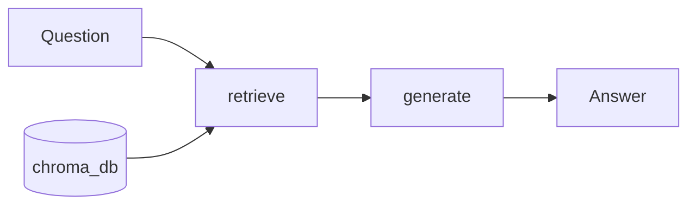

# DEPI Graduation Project — Egyptian Law RAG Agent

A retrieval-augmented generation (RAG) demo that answers questions about **Egyptian law** using a predefined legal corpus, multilingual embeddings, and an LLM routed through OpenRouter. The agent is implemented as a small **LangGraph** pipeline: retrieve relevant chunks from ChromaDB, then generate an Arabic answer grounded in that context.


## Current Status

The current version uses a simple `retrieve -> generate` flow and is designed around specific legal documents. Future improvements may be added later.

## Features

- **Vector store**: [Chroma](https://www.trychroma.com/) with persisted data under `./chroma_db`
- **Embeddings**: `sentence-transformers/paraphrase-multilingual-mpnet-base-v2` (supports Arabic and other languages)
- **Orchestration**: LangGraph — `retrieve` → `generate` → end
- **LLM**: Configured in code via LangChain’s OpenRouter integration (model name is set in `rag_agent/utils/nodes.py`)

## Prerequisites

- Python **3.10+** recommended (project has been run with 3.13)
- An **[OpenRouter](https://openrouter.ai/) API key** for chat completions

## Repository layout

| Path | Role |
|------|------|
| `rag_agent/agent.py` | Builds and compiles the LangGraph; includes sample constitutional questions |
| `rag_agent/utils/nodes.py` | Embeddings, Chroma retriever, prompts (Arabic / English template), LLM, graph nodes |
| `rag_agent/utils/state.py` | `GraphState`: question, documents, answer |
| `rag_agent/utils/ingest.py` | Loads PDF(s), splits text, embeds, writes `./chroma_db` |
| `documents/` | Source PDFs and reference links (`docs_references.txt`) |
| `requirements.txt` | Pinned Python dependencies |

## Setup

1. **Clone** the repository and open a terminal in the project root (`DEPI GP`).

2. **Create and activate a virtual environment** (recommended):

   ```bash
   python -m venv .venv
   .venv\Scripts\activate
   ```

3. **Install dependencies**:

   ```bash
   pip install -r requirements.txt
   ```

4. **Configure OpenRouter**  
   Set your real API key where the project expects it in `rag_agent/utils/nodes.py` (replace the placeholder passed to `ChatOpenRouter`).

## Ingesting documents

Before querying, populate Chroma from the predefined legal source files configured in `rag_agent/utils/ingest.py`:

1. Make sure the configured source files exist in the expected paths.
2. From the project root, run:

   ```bash
   python -m rag_agent.utils.ingest
   ```

   This creates or refreshes `./chroma_db` with chunked embeddings.

If source file paths change, update `pdf_paths` in `ingest.py` and run ingestion again.

## Streamlit Demo

Run the web app from the project root:

```bash
streamlit run app.py
```

The app provides a chat interface, suggested legal questions, and retrieved context snippets for each answer.

## Running the agent

From the project root:

```bash
python -m rag_agent.agent
```

The bundled script loops over example questions and prints answers. You can adapt `agent.py` to accept interactive input or API calls without changing the core graph.

## How it works (high level)



1. **retrieve**: Embedding similarity search over stored chunks.  
2. **generate**: Prompt fills `context` + `question`; the LLM answers using **only** the provided excerpts (with instructions to admit uncertainty when context is insufficient).

## References

`documents/docs_references.txt` lists public URLs for the constitution and related laws (civil code, penal code, commercial law, etc.). Use these for sourcing official texts when extending the corpus.

## Disclaimer

This software is for **learning and research**. It does not constitute legal counsel. Always verify answers against official gazettes and qualified professionals.
